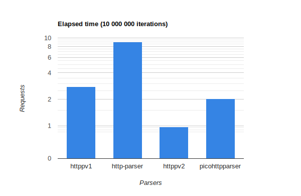
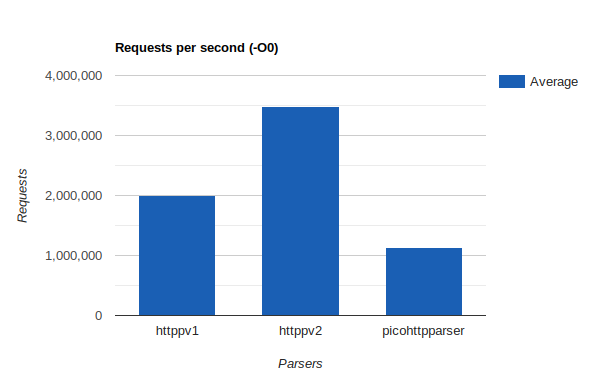

# httpp
Tiny, fast, simple, yet useful header only HTTP/1.1 requests parser for C. httpp has very small codebase and is fully available to your modifications. Want to replace fixed size headers array with a hash table? all yours.

## API

```c
#include <stddef.h>
#include <stdio.h>
#include <stdlib.h>

#define HTTPP_IMPLEMENTATION
#include "httpp.h"

char* req = 
    "POST /api/items HTTP/1.1\r\n"
    "Host: api.example.com\r\n"
    "User-Agent: MyClient/1.0\r\n"
    "Content-Type: application/json\r\n"
    "Content-Length: 44\r\n"
    "\r\n"
    "{\"name\":\"Widget\",\"quantity\":10,\"price\":9.99}";

int main() 
{
    httpp_req_t parsed;
    httpp_header_t headers[HTTPP_DEFAULT_HEADERS_ARR_CAP]; // Array for parsed headers
    httpp_init_req(&parsed, headers, HTTPP_DEFAULT_HEADERS_ARR_CAP); // Initialize the request on stack
    // Alternatively, use this fancy macro:
    // HTTPP_NEW_REQ(parsed, HTTPP_DEFAULT_HEADERS_ARR_CAP);

    httpp_parse_request(req, strlen(req), &parsed); // Parse the request

    printf("%s\n", parsed.body.ptr); // Pointer to the beginning of the body
    printf("%lu\n", parsed.body.length);
    printf("%i\n", parsed.method);

    const char* method = httpp_method_to_string(parsed.method); // Method as string (e.g POST)
    printf("%s\n", method); 

    httpp_header_t* host = httpp_find_header(parsed, "Host"); 
    // Httpp stores pointers to the conentent in your buffer.
    // Each string is storred as "span" or a string view. 
    // to convert it to a null terminated string (malloc'd), use this:
    char* value = httpp_span_to_str(&host->value);
    printf("%s\n", value);

    free(value); // Dont forget to free it when you're done

    httpp_res_t response;
    httpp_header_t response_headers[2]; 
    httpp_init_res(&response, response_headers, 2);

    response.code = 200;
    httpp_res_add_header(&response, "Host", "somehost.some.where");
    httpp_header_t* status = httpp_res_add_header(&response, "Status", "ok");
    // If you try to add more headers than the capacity is, httpp_add_header will return NULL

    char* body = "Some body";
    httpp_res_set_body(response, body, strlen(body)); // httpp_res_set_body sets the pointer to body, it doesn't copy it 

    size_t raw_len;
    char* raw = httpp_res_to_raw(&response, &raw_len); // Convert to a malloc'd raw string 

    printf("\nComposed response: \n");
    printf("----\n%s\n----\n", raw);  // Or write it to a socket
    printf("Response length = %lu\n", raw_len);

    free(raw);

    // When using httpp_res_add_header, it strdups given name and value, so make sure to free it  
    httpp_res_free_added(&response); 
}
```

## Benchmark
All benchmarks were compiled with -O3 flag using gcc _15.2.1 20251112_. Benchmarks were running on a Ryzen 7 with 4.79GHz peek frequency. The code can be found in `benchmarks` directory. Same benchmark was adapted for http-parser. Results of each one is the average of 5 runs.

Benchmarked with the following request (adapted for each one from [picohttp](https://github.com/h2o/picohttpparser))

```c
#define REQ                                                                                                             \
    "GET /wp-content/uploads/2010/03/hello-kitty-darth-vader-pink.jpg HTTP/1.1\r\n"                                     \
    "Host: www.kittyhell.com\r\n"                                                                                       \
    "User-Agent: Mozilla/5.0 (Macintosh; U; Intel Mac OS X 10.6; ja-JP-mac; rv:1.9.2.3) Gecko/20100401 Firefox/3.6.3 "  \
    "Pathtraq/0.9\r\n"                                                                                                  \
    "Accept: text/html,application/xhtml+xml,application/xml;q=0.9,*/*;q=0.8\r\n"                                       \
    "Accept-Language: ja,en-us;q=0.7,en;q=0.3\r\n"                                                                      \
    "Accept-Encoding: gzip,deflate\r\n"                                                                                 \
    "Accept-Charset: Shift_JIS,utf-8;q=0.7,*;q=0.7\r\n"                                                                 \
    "Keep-Alive: 115\r\n"                                                                                               \
    "Connection: keep-alive\r\n"                                                                                        \
    "Cookie: wp_ozh_wsa_visits=2; wp_ozh_wsa_visit_lasttime=xxxxxxxxxx; "                                               \
    "__utma=xxxxxxxxx.xxxxxxxxxx.xxxxxxxxxx.xxxxxxxxxx.xxxxxxxxxx.x; "                                                  \
    "__utmz=xxxxxxxxx.xxxxxxxxxx.x.x.utmccn=(referral)|utmcsr=reader.livedoor.com|utmcct=/reader/|utmcmd=referral\r\n"  \
    "\r\n"
```



| httppv1     | [http-parser](https://github.com/nodejs/http-parser) | httppv2     | [picohttpparser](https://github.com/h2o/picohttpparser) |
| ----------- | ----------- | ----------- | -------------- |
| `2.788205s` | `9.055873s` | `0.964826s` | `2.035271s`    |



| httppv1     | [http-parser](https://github.com/nodejs/http-parser) | httppv2     | [picohttpparser](https://github.com/h2o/picohttpparser) |
| ----------- | ------------ | ----------- | -------------- |
| 3586537.12  | 1104255.77   | 10364561.00 | 4913351.09     |